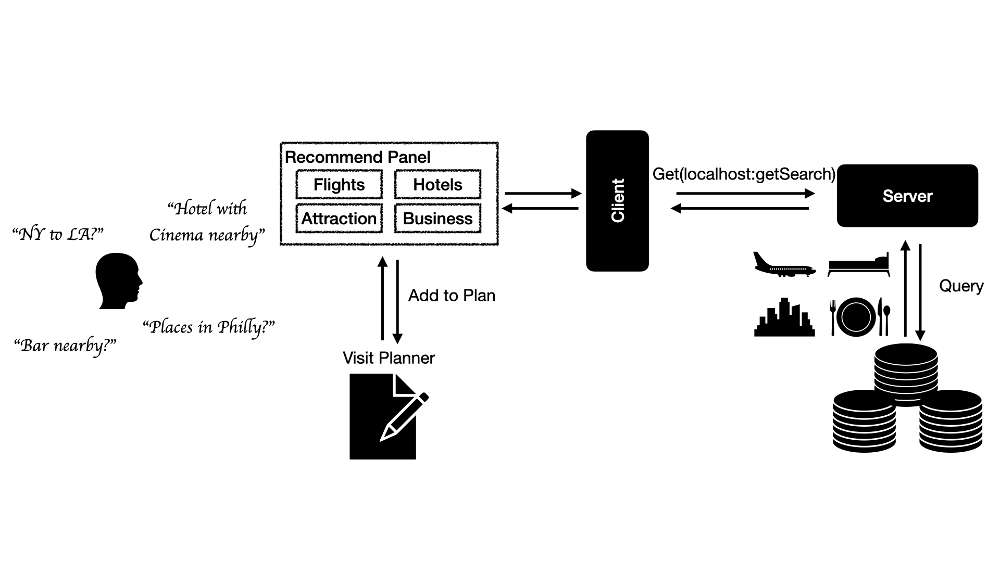
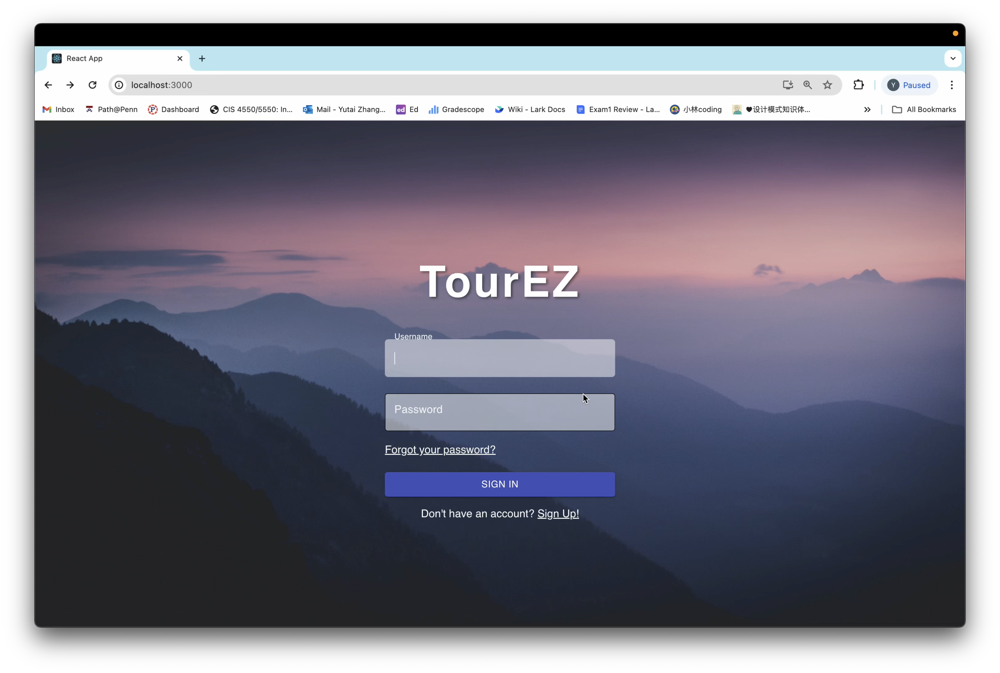
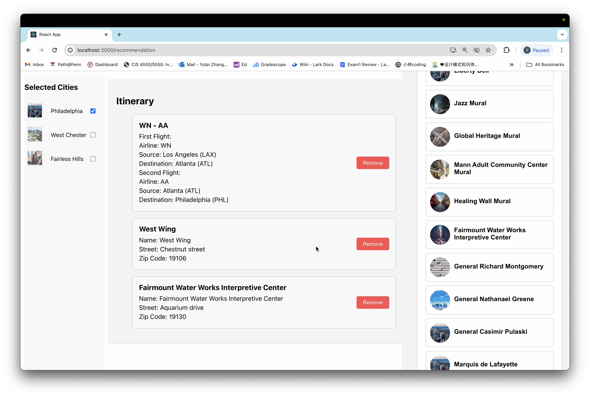

# TourEZ

**TourEasy: Simplifying Travel Itinerary Planning**

Planning a travel itinerary has traditionally been a daunting task for many travelers. From poring over numerous travel guides and scouring through various travel communities for tips, to toggling between different websites for flights, hotels, and maps, the process can quickly become overwhelming. This exhausting experience inspired TourEasy, a web application designed to make travel planning effortless and enjoyable. By simply entering their travel preferences, such as modes of transportation, attractions, and accommodations, users can rely on TourEasy to connect the dots and deliver the best possible route. Our system also highlights the most recommended attractions for the entered destination, ensuring travelers have the best experience and don’t miss any must-visit sites.


## Overview

Once users start by selecting their departure city, destination, and travel days, the application introduces a user-friendly interface. A sidebar tab for each day of the trip allows users to add resorts they wish to visit, order these resorts, and then the application generates the shortest route connecting the departure point, destination, and all selected resorts for the day.

For an enhanced planning experience, another sidebar recommends the most popular resorts and restaurants of the place, enabling users to easily choose and plan their activities. If users prefer not to spend time planning routes and resorts manually, the application can auto-generate a route for the day for user reference.

After the trip planning is complete, the application offers a feature to export the itinerary. This export includes all information about flights, stays, and resorts, which is especially useful for visa applications or as a backup. This suite of features makes TourEasy a comprehensive tool for making travel planning effortless and enjoyable. A more comprehensive explanation of each feature is detailed below.


### Main Feature

* **Flight Booking**: We offer personalized flight recommendations tailored to your preferences, allowing you to select options such as direct flights or those with one immediate stop. Whether you're traveling for business or leisure, we aim to streamline your journey with convenient booking solutions.
* **Tailored Hotel Recommendations**: Find the perfect accommodation that suits your unique needs. Whether you crave a culinary experience or seek specific amenities, such as an abundance of Chinese cuisine nearby, we curate hotel recommendations to match your preferences, ensuring a comfortable and satisfying stay.
* **Visit Planning**: Plan your itinerary effortlessly with our visit planning feature.
  * **Discovery Nearby Attractions**: Explore a variety of nearby attractions based on your chosen accommodation. Access detailed information about each attraction, including opening hours, ratings, and review
  * **Locate Nearby Businesses**: Easily find businesses situated near the attractions you plan to visit.Discover restaurants, cafes, shops, and other establishments conveniently located in the area. Explore dining options, shopping opportunities, and other amenities available in the vicinity of your chosen attractions.We might implement

    **Sorting Options (depending on data avalability)**

- **Popularity**: Users can sort attractions based on their popularity among other travelers, helping to identify must-visit sites.
- **Ratings and Reviews**: Attractions can be sorted by user ratings and reviews, allowing travelers to choose highly recommended experiences.
- **Price**: For budget-conscious travelers, sorting by price enables them to find attractions that fit their budget constraints.

## How to run our app

* Server end:The backend server is assumed to be running on http://localhost:8050
    ```bash
    // open a terminal 
  cd /server
  npm install
  npm start
  ```
* Client end:The client is assumed to be running on http://localhost:3000
  ```bash
    // open a terminal 
  cd /client
  npm install
  npm start
  ```

## Preprocess

- **Data Cleaning**:
  - Remove uninteresting columns land rows with missing values
  - Remove duplicates and irrelevant data
  - Correct or remove erroneous entries and outliers that can skew data analysis
- **Data Integration**:
  - Combine databases by identifying common fields, such as merging FlightRoute with city names based on the relationship between airports and cities.
  - Resolve conflicts where the same data may have different formats or values across databases
- **Normalization**:
  - Standardize data formats for dates, numeric fields, and text to ensure consistency
  - Apply normalization rules to reduce redundancy and dependency
- **Data Transformation**:
  - Convert data into a suitable format or structure for querying and analysis (e.g., CSV to SQL and JSON to SQL).

## Architecture

### Technologies Used:

- React: A JavaScript library for building user interfaces.
- Axios: A promise-based HTTP client for making API requests.
- React Router: A library for handling navigation and routing in a React application.
- CSS: Cascading Style Sheets for styling the components and pages.
  2.2 System Architecture/Application Description:




### Component architecture

The application follows a component-based architecture using React. It consists of multiple pages and components that interact with each other to provide a comprehensive travel recommendation system. The main components and pages are organized into separate folders based on their functionality. The application communicates with a backend server using Axios to fetch data from various endpoints. The backend server is assumed to be running on http://localhost:8050 and provides APIs for retrieving states, cities, attractions, businesses, flights, and hotels.The main entry point of the application is index.js, which renders the App component. The App component sets up the routing using React Router and renders the appropriate components based on the current route.Pages and Features:

1. Login Page (LoginPage.js):

- Serves as the initial page of the application.
- Provides interfaces for users to login and sign up.

2. Main Page (MainPage.jsx):

- Displays the main interface of the travel recommendation system.
- Consists of a left panel (LeftPanel.jsx) which allows users to select a state and a city using buttons (StateButton.jsx and CityButton.jsx).

3. Radar Map (RadarMapPanel.jsx):

- Displays a radar map of the selected city.
- Shows the score of attractions, entertainments, restaurants and hotels of a selected city (SingleRadarMap.jsx).

4. Recommendation Page (Recommendation.jsx):

- Consists of a left panel (LeftPanel.jsx) , a travel itinerary(Procedure.jsx), a right panel (RightPanel.jsx).
- The left panel displays the selected city.
- The travel itinerary displays the user's selected items (flights, attractions, businesses, hotels) and allows users to remove items from the itinerary (ProcedureItem.jsx).
- The right panel displays different search options based on the selected tab (flight, attraction, business, hotel).

5. Flight Search (FlightSearch.jsx):

- Allows users to search for flights between two cities.
- Provides options to select the source and destination states and cities.
- Allows users to choose between direct flights and transit flights.
- Displays the search results with flight details and allows users to select a flight and add it into itinerary.

6. Attraction Search (AttractionSearch.jsx):

- Allows users to search for attractions in a selected city.
- Displays a list of attractions with their details (AttractionButton.jsx).
- Allows users to view more details of an attraction in a modal (AttractionModal.jsx).
- Provides an option to view nearby attractions (NearbyAttractions.jsx).

7. Business Search (BusinessSearch.jsx):

- Allows users to search for businesses in a selected city.
- Displays a list of businesses with their details (BusinessButton.jsx).
- Allows users to view more details of a business in a modal (BusinessModal.jsx).
- Provides an option to view nearby businesses (NearbyBusinesses.jsx).

8. Hotel Search (HotelSearch.jsx):

- Allows users to search for hotels in a selected city.
- Displays a list of hotels with their details (HotelButton.jsx).
- Allows users to view more details of a hotel in a modal (HotelModal.jsx).
- Provides options to filter hotels based on business categories and other criteria.
  The application also includes a navigation bar (NavBar.js) that allows users to switch between different pages and components.



